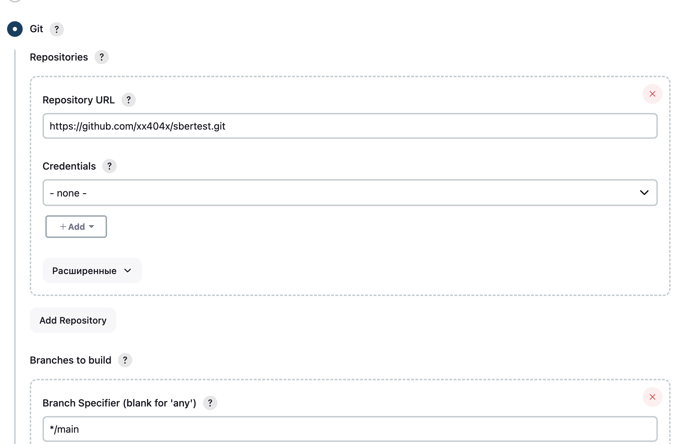
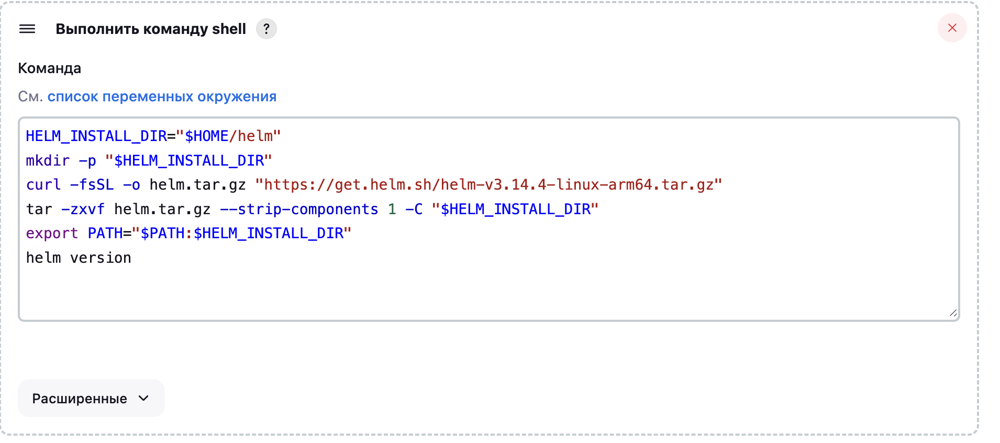
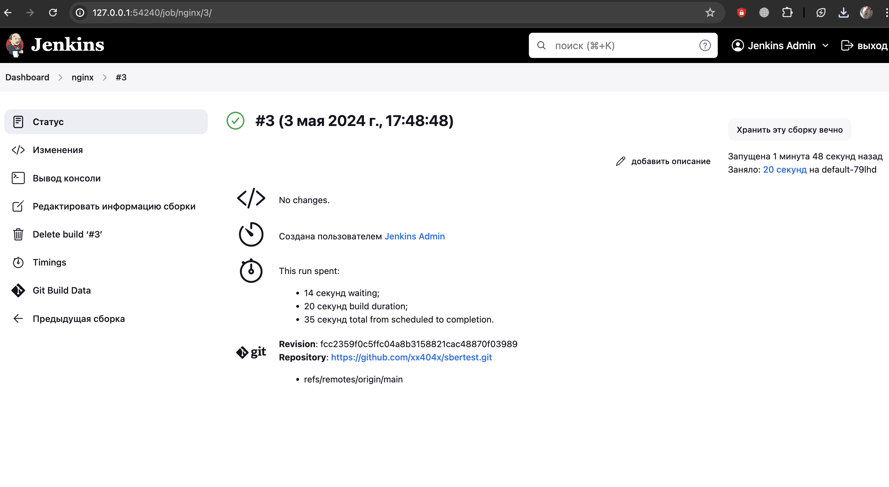
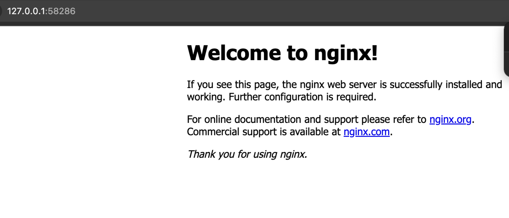

# Тестовое для Сбера

*выполнялось на apple chip m2

## Шаг 1. Установка Minikube и kubectl

#### Устанавливаем minikube 

```sh
brew install minikube 
```
#### Устанавливаем kubectl
```sh
brew install kubectl
```
#### Запускаем minikube с драйвером docker
```sh
minikube start --driver=docker
```

## Шаг 2: Установка и настройка helm
```sh
brew install helm
```
#### Создание helm чарта для Nginx
```sh
helm create nginx
```
#### Настройка чарта 
Редактируем секции **service** в values.yaml и проверяем секцию **spec** в deployment.yaml

values.yml
```yml
service:
  type: NodePort
  port: 80
  nodePort: 32080
```
Проверяем секцию **spec** в deployment.yaml

deployment.yml
```yml
spec:
  containers:
  - name: nginx
    image: nginx:latest
    ports:
    - containerPort: 80
```
Секция **containers** должна выглядеть так:

```yml
containers:
        - name: {{ .Chart.Name }}
          securityContext:
            {{- toYaml .Values.securityContext | nindent 12 }}
          image: "{{ .Values.image.repository }}:{{ .Values.image.tag | default .Chart.AppVersion }}"
          imagePullPolicy: {{ .Values.image.pullPolicy }}
          ports:
            - name: http
              containerPort: {{ .Values.service.port }}
              protocol: TCP
```
Редактируем service.yml в директории templates \
Убедимся, что сервис настроен для использования порта и типа, указанных в *values.yml*
```yml
apiVersion: v1
kind: Service
metadata:
  name: {{ include "nginx.fullname" . }}
  labels:
    {{- include "nginx.labels" . | nindent 4 }}
spec:
  type: {{ .Values.service.type }}
  ports:
    - port: {{ .Values.service.port }}
      targetPort: http
      protocol: TCP
      name: http
  selector:
    {{- include "nginx.selectorLabels" . | nindent 4 }}
```
#### Пакетируем чарт и устанавливаем его в minikube 

Возвращаемся в корневую директорию 
```sh
cd ..
helm package nginx/
```
Устанавливаем чарт
```sh
helm install nginx ./nginx-0.1.0.tgz
```

Проверяем 
```sh
minikube service nginx --url
```
## Шаг 3. Разворачиваем Jenkins в minikube

Добавляем репозиторий helm для jenkins

```sh
helm repo add jenkins https://charts.jenkins.io
helm repo update
```

Создаем файл *jenkins-values.yaml*

Редактируем:
```sh
controller:
  serviceType: NodePort
  nodePort: 32080
  admin:
    username: admin
    password: admin
persistence:
  enabled: false
```
Устанавливаем:

```sh
helm install jenkins jenkins/jenkins -f jenkins-values.yaml
```

Получаем пароль
```sh
kubectl exec --namespace default -it jenkins -- /bin/cat /run/secrets/additional/chart-admin-password && echo
```

Получаем url для доступа к jenkins

```sh
export NODE_PORT=$(kubectl get --namespace default -o jsonpath="{.spec.ports[0].nodePort}" services jenkins)
export NODE_IP=$(minikube ip)
echo http://$NODE_IP:$NODE_PORT
```

Запускаем 

```sh
minikube service jenkins --url
```

Пушим на гитхаб наш чарт

```sh
git init
git add .
git commit -m "helm"
git remote add origin https://github.com/xx404x/sbertest.git
git push origin main
```

## Шаг 4. Создаем job в jenkins

Вводим логин admin и пароль, который мы получили

```sh
login: admin
pass: DX0xsJC3HMS29PiSM2MkPJ (может быть и admin)
```

Далее создаем новый item->создаем фристайл задачу->указываем гит репу и ветку


Так же, создаем jenkins-rbac.yml 
Листаем в самый низ и выбираем **выполнить команду shell**
```sh
# Устанавливаем helm в домашнюю директорию пользователя
```


Запускаем сборку 




